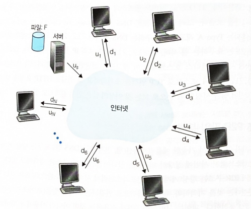
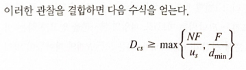
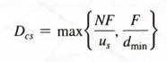
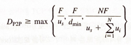
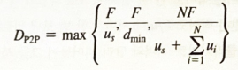
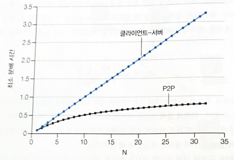
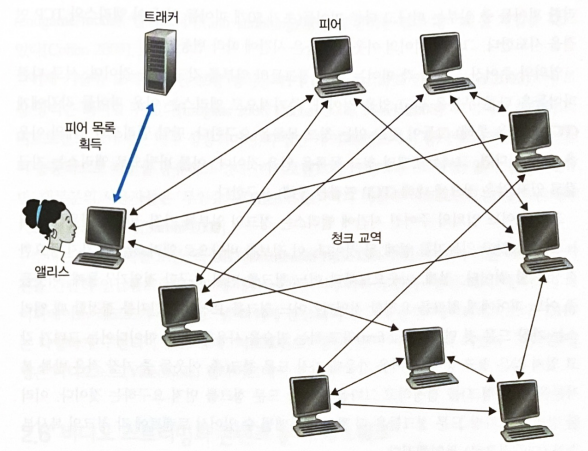
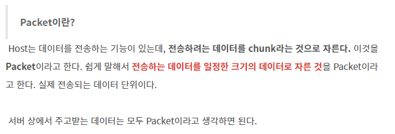
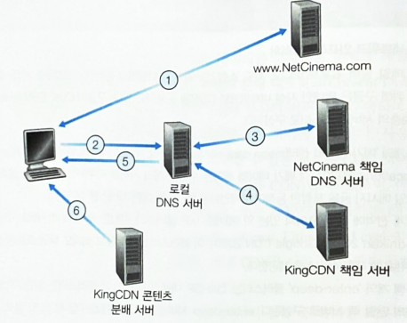
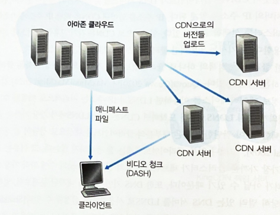

# 07.28/ 2.5-2.6

# 2.5. P2P 파일분배

현재까지 기술한 애플리케이션(웹, 전자메일, DNS 등) 모두는 항상 켜져 있는 인프라스트럭처 서버에 의존하는 클라이언트-서버 구조를 채택하고 있음.

P2P 구조는 항상 켜져 있는 인프라스트럭처 서버에 최소한으로(혹은 전혀 안 함) 의존한다. 대신 간헐적으로 연결되는 호스트 쌍들이 서로 직접 통신함. 피어는 서비스 제공자가 소유하는 것이 아니라 사용자가 제어하는 데스크톱과 랩톰, 스마트폰이 소요함.

커다란 파일을 한 서버에서 다수의 호스트(피어)로 분배하는 매두 자연적인 P2P 어플리케이션을 다룸. 이 파일은 리눅스 운영체제의 새로운 버전 등일 수 있다.

클라이언트-서버 분배에서 서버는 파일 복사본을 각 피어들에게 보내야함. (서버에게 부하를 주고 많은 양의 서버 대역폭을 소비함.) P2P 파일 분배에서 각 피어는 수신한 파일의 임의의 부분을 다른 피어들에게 재분배할 수 있어서 서버의 분배 프로세스를 도울 수 있음.

2020년도 기준 인기 있는 P2P 파일 분배 프로토콜은 `비트토렌트`

### P2P 구조의 확장성

`두 가지 구조 유형에 대해 한 파일을 고정된 수의 피어들에게 분배하는 양적 모델 고려`

서버와 피어들은 `접속 링크로 인터넷에 연결`되어 있음.

(세부적 설명 책 참고)

`분배시간`은 모든 N개의 피어들이 파일의 복사본을 얻는 데 걸리는 시간.

분배 시간에 대한 분석에서 클라이언트-서버와 P2P 구조 모두의 경우, 인터넷 코어가 풍부한 대역폭을 갖고 있다는 간단한 가정을 하며, 모든 병목 현상은 네트워크 접속 부분에 있음을 의미함.

`클라이언트-서버 구조에 대한 분배 시간을 결정`

- 클라이언트-서버 구조에서는 어떤 피어도 파일을 분배하는 데 도움을 주지 않음.
- 서버는 파일 복사본을 N개의 피어 각각에게 전송해야 함. 따라서 서버는 NF 비트를 전송해야 함.
- dmin이 가장 낮은 다운로드 속도를 가진 피어의 다운로드 속도를 나타낸다고 하자. 가장 낮은 다운로드 속도를 가진 피어는 F/dmin초보다 적은 시간에 파일의 모든 F비트를 얻을 수 없다. 최소 분배 시간은 적어도 F/dmin이다.

이는 클라이언트-서버 구조에 대한 최소 분배 시간의 **하한값**을 제공함.

우선 해당 책에서는 제공된 하한값을 실제 분배시간으로 채택한다.

충분히 큰 N에 대해 클라이언트-서버 분배 시간은 NF/us로 주어진다는 사실을 알 수 있음.

⇒ **분배 시간은 피어의 수 N에 따라 선형적으로 증가함.**

(ex. 한 주에서 다음 주까지 피어의 수가 천에서 백만으로 천 배 증가한다면, 파일을 모든 피어에게 분배하는 데 필요한 시간도 천 배 증가함.)

`P2P 구조에 대해서도 분석`

각 피어들이 서버가 파일을 분배하는 데 도움을 줄 수 있음. 특히 한 피어가 파일 데이터 일부를 수신할 때, 피어는 그 데이터를 다른 피어들에게 재분배하는 데 **자신의 업로드 용량을 이용할 수 있음.**

P2P 구조에 대한 분배 시간을 계산하는 방법은 클라이언트-서버 구조의 경우보다 더 복잡 why? ⇒ **분배 시간이 각 피어가 다른 피어들에게 파일의 일부를 어떻게 분배하느냐에 달려 있기 때문**

그럼에도 불구하고 최소 분배 시간에 대한 간단한 수식을 얻을 수 있음!

- 분배가 시작되면 서버만이 파일을 갖고 있다. 해당 파일이 피어 커뮤니티에 도달할 수 있도록 하기 위해, 서버는 적어도 한 번 접속 링크로 파일의 각 비트를 보내야 함. `따라서 최소 분배 시간은 적어도 F/us`이다.
- 최소 분배 시간은 적어도 F/dmin이다.
- 시스템의 전체 업로드 용량은 전체적으로 서버의 업로드 속도와 각 피어들의 업로드 속도를 더한 것이다. 시스템은 N개 피어들 각각에게 F비트를 전달(업로드)해야 한다. 이는 u(total)보다 더 빠른 속도로 할 수는 없음. 따라서 `최소 분배 시간은 적어도 NF/(u(total))이다.`

위의 세 가지 관찰을 결합하면, P2P에 대한 최소 분배 시간을 아래와 같이 얻을 수 있음.

위의 식은 P2P 구조에 대한 `최소 분배 시간에 대한 하한값`을 제공함.

만약 각 피어가 비트를 수신하자마자 그 비트를 재분배할 수 있다고 가정한다면 이 하한값을 실제로 얻는 재분배 방식이 있음. 현실에서는 개별적인 비트보다는 `파일의 청크`가 재분배되는데, 위의 식은 실제 최소 분배 시간에 대한 좋은 근삿값을 제공함.

따라서 위의 식이 제공하는 하한값을 실제 최소 분배 시간으로 채택한다.

클라이언트-서버의 경우 피어의 수가 증가함에 따라 분배 시간이 선형적으로, 한계 없이 증가하는 것을 알 수 있음. 그러나 P2P 구조의 경우 최소 분배 시간이 클라이언트-서버 구조의 분배 시간보다 항상 작지는 않음. 또한 임의의 피어 수 N에 대해 `한 시간보다 작다.`

why? ⇒ us가 0으로 취급…

따라서 `P2P 구조를 가진 애플리케이션은 자가 확장성을 갖는다.` 이 확장성은 피어가 비트의 소비자이자 재분배자인 것의 직접적인 결과다.

### 비트토랜트

비트토렌트는 `파일 분배를 위한 인기 있는 P2P 프로토콜`이다.

특정 파일의 분배에 참여하는 모든 피어의 모임을 **토렌트**라고 함.

토렌트에 참여하는 피어들은 서로에게서 `같은 크기의 청크`를 다운로드 함.

여기서, **청크(chunk)**란?

(의문점: 그럼 packet을 자르는데 필요한 도구가 chunk라는 건가? or 데이터 덩어리?)

청크는 SCTP (Stream Control Transmission Protocol)에서 사용되는 제어 데이터 (C / D) 및 패킷 세트입니다. SCTP 패킷은 공통 헤더와 데이터 청크로 구성되며 내용에 따라 다릅니다.

일반적인 청크의 크기는 256킬로바이트다.

피어가 처음으로 토렌트에 가입하면, 그 피어에는 청크가 없지만 시간이 지남에 따라 점점 많은 청크를 쌓을 수 있음. 피어가 청크를 다운로드할 때 피어는 또한 청크를 다른 피어들에게 업로드 함.

한 피어가 전체 파일을 얻으면, 토렌트를 떠날 수 있거나 혹은 토렌트에 남아서 다른 피어들로 청크를 꼐속해서 업로드할 수 있음. 또는 어떤 피어는 일부 청크만을 가진 채로 토렌트를 떠날 수 있으며, 후에 토렌트에 재가입할 수 있음. (이타적: 받고 보상주고?, 이기적: 파일받고 아무것도 안 주는 것, 이기적인 것을 지양해야하므로 tft가 사용됨.)

`비트토렌트가 어떻게 동작하는가?`

각 토렌트는 `트래커`라고 부르는 인프라스트럭처 노드를 갖고 있음. 한 피어가 토렌트에 가입할 때 트래커에 자신을 등록하고 주기적으로 자신이 토렌트에 있음을 알림. 이러한 방식으로 트래커는 토렌트에 참여하는 피어들을 추적함. 주어진 토렌트는 어느 순간에 수백 혹은 수천의 피어들이 참여하고 있을 수 있음.

위의 그림에 보이는 것처럼, 새로운 피어 앨리스가 토렌트에 가입할 때 트래커는 참여하고 있는 피어 집합에서 임의로 피어들의 부분집합을 선택하여 이 50개 피어들의 IP 주소를 앨리스에게 보냄.

피어들의 목록을 얻고 나서, 앨리스는 이 목록에 있는 모든 피어와 동시에 TCP 연결을 설정함. 앨리스가 성공적으로 TCP 연결을 설정한 모든 피어를 `이웃 피어`라고 부름.

시간이 지남에 따라 이러한 피어들 중 일부는 떠나고 다른 피어들(초기 50개 피어들 외에)이 앨리스와 TCP 연결을 시도함. ⇒ `피어의 이웃 피어들은 시간에 따라 변동`

그래서 어느 임의의 주어진 시간에 앨리스는 청크의 일부를 가질 것이고 이웃들이 어느 청크를 갖고 있는지를 알게 될 것임. 해당 정보를 통해 앨리스는 두 가지 중요한 결정을 할 것임.

- **이웃으로부터 어느 청크를 먼저 요구할 것인가?**
- **이웃들 중 어느 피어에게 청크를 요청할 것인가?**
  - 어느 청크를 요청할 것인지를 결정할 때 앨리스는 `가장 드문 것 먼저`라고 하는 기술을 사용함.
  - 해당 아이디어는 그녀가 갖고 있지 않은 청크 중에서, 이웃 가운데 가장 드문 링크(즉, 이웃들 중 가장 적은 반복 복사본을 가진 청크)를 결정하고 그다음에 가장 드문 청크를 먼저 요구하는 것임. ⇒ 가장 드문 청크들은 더 빨리 재분배도리 수 있어서 토렌트에 각 청크의 복사본수가 (대략적으로)동일해짐.

어느 요청에 그녀가 응답할지 결정하기 위해 비트토렌트는 `현명한 교역 알고리즘`을 사용함.

기본 아이디어는 앨리스가 가장 빠른 속도로 앨리스에게 데이터를 제공하는 이웃에게 우선순위를 주는 것임.

앨리스는 계속해서 그녀가 비트를 수신하는 속도를 측정하고 가장 빠르게 전송하는 4개의 피어를 결정함. 그러고 나서 4개의 피어에게 청크를 보냄으로써 보답함. 앨리스는 10초마다 속도를 재계산하고 4개의 피어 집합을 수정함. 비트토렌트 용어로 이러한 4개의 피어는 **활성화**되었다고 함.

30초마다 임의로 피어 하나를 추가로 선택하여 그것에게 청크를 보낸다는 점이 중요함.

임의로 선택된 피어를 밥이라고 하자. 밥은 **낙관적으로 활성화**되었다고 함. 앨리스가 밥에게 데이터를 보내고 있기 때문에 그녀는 밥의 4개 업로더 중 하나가 될 수 있으며, 이 경우 밥은 앨리스에게 데이터를 보내기 시작함. 밥이 데이터를 앨리스에게 보내는 속도가 충분히 높으면, 밥은 이제 앨리스의 4개 업로더 중 하나가 될 수 있음. ⇒ `30초마다 앨리스는 임의로 새로운 교역 파트너를 선택하고 그 파트너와 교역을 시작함.`

두 피어들이 교역에 만족하면 그들은 서로를 4개의 목록에 넣을 것이고 피어 중 누구 하나가 더 좋은 파트너를 만날 때까지 서로와 교역을 계속 할 것. 그 효과는 양립할 수 있는 속도로 업로드할 능력을 가진 피어들이 서로 찾으려는 경향이 있다는 것. 또한 임의의 이웃 선택은 새로운 피어들이 청크를 얻게 하여 그들이 교역할 수 있는 무엇인가를 가질 수 있음.

이러한 5개 피어(`4개의 상위 피어와 하나의 탐색 피어`) 외의 모든 이웃 피어는 **비활성화**, 즉 이들은 앨리스로부터 어떠한 청크도 받지 않는다. 비트토랜트는 여기서는 논의하지 않은 조각(미니청크), 파이프라이닝, 무작위 우선 선택, 마지막 게임 모드, 안티스너빙 등을 포함하는 많은 흥미로운 기법을 갖고 있음.

기술한 교역을 위한 보상 방식을 `TFT`라고 함. 해당 보상 방식은 회피할 수 있음. 그럼에도 불구하고, 비트토렌트 생태계는 매우 성공적이며, 수십만 개의 토렌트에서 동시에 수백만의 피어들이 **능동적으로 파일을 공유하고 있음.**

TFT 없이 설계되었다면, 대부분의 사용자들은 ‘무임승차족’이기 때문에 현재 존재하지도 않았을 것임.

---

# 2.6 비디오 스트리밍과 콘텐츠 분배 네트워크

`비디오 스트리밍 서비스가 어떻게 구현되는가에 대한 개요`

## 2.6.1 인터넷 비디오

스트리밍 비디오 애플리케이션에서는 미리 녹화된 비디오 등을 등을 대상으로 함. 이러한 녹화된 비디오는 서버에 저장되어 사용자가 비디오 시청을 서버에게 **온디맨드(사용자가 원하는대로)**로 요청함.

넷플릭스, 유튜브(구글), 아마존, 틱톡 등 많은 인터넷 회사가 비디오 스트리밍을 지원하고 있음.

비디오의 중요한 특징은 **압축될 수 있다는 것**인데, `비디오 품질과 비트 전송률은 서로 반비례 함.(trading off)`

오늘날의 상용 압축 알고리즘은 원하는 모든 비트 전송률로 비디오를 압축할 수 있음. 물론 비트 전송률이 높을수록 이미지 품질이 좋아지고 전반적인 사용자 시청 환경이 향상됨.

네트워킹 측면에서 비디오의 가장 두드러진 특성은 **높은 비트 전송률**이다.

현재까지 스트리밍 비디오에서 가장 중요한 성능 척도는 **평균 종단 간 처리량**이다. 연속재생을 제공하기 위해, 네트워크는 압축된 비디오의 전송률 이상의 스트리밍 애플리케이션에 대한 평균 처리량을 제공해야 함.

압축을 사용하여 동일한 비디오를 여러 버전의 품질로 만들 수 있음.

## 2.6.2 HTTP 스트리밍 및 DASH

HTTP 스트리밍에서 비디오는 HTTP 서버 내의 특정 URL을 갖는 일반적인 파일로 저장됨.

사용자가 비디오 시청을 원하면 클라이언트는 서버에게 TCP 연결을 설립하고 해당 URL에 대한 HTTP `GET 요청`을 발생시킴. 그러면 서버가 기본 네트워크 프로토콜 및 트래픽 조건이 허용되는 대로 HTTP 응답 메시지 내에서 비디오 파일을 전송함.

클라이언트 쪽에서는 애플리케이션 버퍼에 전송된 바이트가 저장됨. 이 버퍼의 바이트 수가 미리 정해진 임곗값을 초과하면 클라이언트 애플리케이션 버퍼에서 주기적으로 비디오 프레임을 가져와 프레임을 압축해제한 다음 사용자의 화면에 표시함.

**비디오 스트리밍 애플리케이션은 비디오의 후반 부분에 해당하는 프레임을 수신하고 버퍼링할 때 비디오를 표시함. (동시\_받으면서 압축해제 동시에)**

HTTP 스트리밍은 많은 시스템에서 실제 적용되고 있으나, 중요한 문제점이 있음. ⇒ `클라이언트가 그들 사이의 가용 대역폭의 차이에도 불구하고 똑같이 인코딩된 비디오를 전송받는다는 점.`

가용 대역폭의 차이는 각기 다른 클라이언트들 간에 존재할 뿐만 아니라 동일한 클라이언트에서도 시간에 따른 차이가 발생함.

`해당 문제점으로 인해 새로운 형태의 **HTTP 기반 스트리밍인 DASH가` 개발됨.\*\*

DASH에서 비디오는 여러 가지 버전으로 인코딩되며, 각 버전은 비트율과 품질 수준이 서로 다름.

`클라이언트`는 동적으로 서로 다른 버전의 비디오를 몇 초 분량의 길이를 갖는 비디오 조각(chunk)로 요청함. 가용 대역폭이 충분할 때는 높은 비트율의 비디오 버전을 요청하며, 가용 대역폭이 적을 때는 낮은 비트율의 비디오 버전을 요청함.

**클라이언트는 HTTP GET 요청을 이용해 다른 버전의 비디오 조각을 매번 선택함.**

DASH는 서로 다른 인터넷 접속 회선을 가진 클라이언트들에게 서로 다른 인코딩률을 갖는 비디오를 선택할 수 있도록 허용함.

DASH를 사용할 때, 각 비디오 버전은 HTTP 서버에 서로 다른 URL을 가지고 저장됨. HTTP 서버는 비트율에 따른 각 버전의 URL을 제공하는 **매니페스트 파일**을 갖고 있음.

- 클라이언트는 먼저 매니페스트 파일을 요청하여 서버에서 제공되는 다양한 버전에 대해 알게됨.
- 클라이언트는 매번 원하는 버전의 비디오 조각 단위 데이터를 선택하여 HTTP GET 요청 메시지에 URL과 byte-range를 지정하여 요청함.
- 비디오 조각 단위 데이터를 다운로드하는 동안 클라이언트는 측정된 수신 대역폭과 비트율 결정 알고리즘을 이용해 다음에 선택할 비디오 조각 단위 데이터의 버전을 결정함.
- 클라이언트가 충분한 분량의 버퍼링된 비디오를 갖고 있고 측정된 수신 대역폭이 크다면 고품질의 비디오 조각을 선택할 것.

**DASH는 클라이언트가 서로 다른 품질 수준을 자유롭게 변화시킬 수 있도록 허용함.**

## 2.6.3 콘텐츠 분배 네트워크(CDN)

인터넷 비디오 회사에서 스트리밍 서비스를 제공하는 가장 단순한 방법은 단일 거대 데이터 센터를 구축하고 모든 비디오 자료를 데이터 센터에 저장한 뒤 전 세계의 사용자에게 비디오 스트림을 데이터 센터로부터 직접 전송하는 것.

그러나 세 가지 문제점이 있다.

- 클라이언트가 데이터 센터로부터 지역적으로 먼 지점에 있는 경우, 서버로부터 클라이언트로의 패킷 경로는 많은 다양한 통신 링크와 ISP를 거쳐 가게 되는데, 이러한 ISP는 각기 다른 대륙에 위치할 수도 있음.
  - 링크들 중 하나라도 비디오 소비율보다 낮은 전송용량을 갖는다면 종단 간 처리율이 낮아지고 사용자는 화면 정지 현상을 겪게 됨. (종단 간 경로 길이가 길어질수록 해당 현상은 증가함.)
- 인기 있는 비디오는 같은 통신 링크를 통해 여러 번 반복적으로 전송될 것이라는 점
  - 네트워크 대역폭의 낭비는 물론 회사는 회선을 제공하는 ISP들에게 동일한 바이트를 전송하는 것에 대해 중복 비용을 지불하는 결과를 초래함.
- 단일한 데이터 센터를 구축하면 한 번의 장애로 인해 전체 서비스가 중단될 수 있는 위험이 있음.

엄청난 양의 비디오 데이터를 분배하는 문제를 해결하기 위해 대부분의 비디오 스트리밍 회사들은 **콘텐츠 분배 네트워크(CDN)**을 이용함.

CDN은 다수의 지점에 분산된 서버들을 운영하며, 비디오 및 다른 형태의 웹 콘텐츠 데이터의 복사본을 분산 서버에 저장함. 사용자는 최선의 서비스와 사용자 경험을 제공할 수 있는 지점의 CDN 서버로 연결됨.

(ex. 유튜브의 비디오는 구글의 CDN을 통해 분배됨.)

`CDN의 서버의 위치에 대한 두 가지 철학`

- **Enter Deep**
  - 서버 클러스터를 세계 곳곳의 접속 네트워크에 구축함으로써 ISP의 접속 네트워크로 **깊숙이 들어가는 것**이다.
  - 수천 개의 지점에 서버 클러스터를 구축함으로써 해당 방식을 구현함.
  - 목적은 서버를 최대한 사용자 가까이에 위치시켜 사용자와 CDN 서버 사이의 링크 및 라우터 수를 줄이고, 사용자가 경험하는 지연 시간 및 처리율을 개선하는 것.
  - `문제: 고도로 분산된 설계로 인해 서버  클러스터를 유지 관리하는 비용이 커짐.`
- Bring Home
  - 더 적은 수의 핵심 지점에 큰 규모의 서버 클러스터를 구축하여 ISP를 Home으로 가져오는 개념.
  - 접속 ISP에 연결하는 대신, 그들의 클러스터를 인터넷 교환 지점(IXP\_가장 상위)에 배치됨.
  - Enter Deep에 비해 클러스터 유지 및 관리 비용이 줄어드는 대신에 사용자가 느끼는 지연 시간과 처리율은 상대적으로 나빠짐.

서버 클러스터의 위치가 정해지면 CDN은 콘텐츠의 복사본을 이들 클러스터에 저장함.

CDN은 각 클러스터마다 모든 비디오의 복사본을 전부 유지할 필요는 없음. (어떤 비디오는 인기가 거의 없거나 일부 특정 국가에서만 인기가 있을 수 있기 때문)

실제로 CDN은 클러스터에 대해 푸시 방식이 아닌 **풀(pull) 방식**을 사용함.

어떤 사용자가 지역 클러스터에 없는 비디오를 요청하면, 해당 비디오를 중앙 서버나 다른 클러스터로부터 전송받아 사용자에게 서비스하는 동시에 복사본을 만들어 저장함.

인터넷 캐시와 마찬가지로 클러스터의 저장 공간이 가득 차면 자주 사용되지 않는 비디오 데이터는 삭제됨.

### CDN 동작

사용자 호스트의 웹 브라우저가 URL을 지정함으로써 특정 비디오의 재생을 요청하면 CDN은 그 요청을 가로채

- 그 시점에서 클라이언트에게 가장 적당한 CDN 클러스터를 선택하고
- 클라이언트의 요청을 해당 클러스터의 서버로 연결함.

CDN이 가장 적당한 클러스터를 어떻게 결정하는지 논의할 것.

`먼저 사용자의 요청을 가로채고 다른 곳으로 연결하는 절차를 살펴본다.`

대부분의 CDN은 사용자의 요청을 가로채고 다른 곳으로 연결하는 데 DNS를 활용함.

`상황: NetCinema라는 콘텐츠 제공자가 KingCDN이라는 CDN 업체를 이용해 비디오를 고객에게 분배한다고 하자.`

NetCinema의 웹 페이지에서는 각 비디오가 ‘video’라는 문자열과 고유한 ID를 포함하는 URL을 할당받음.

예를 들어 ‘트랜스포머 7’ 비디오는 [http://video.netcinema.com/6Y7B23V](http://video.netcinema.com/6Y7B23V) 라는 URL을 할당 받음. 아래와 같은 6단계의 과정이 일어남.

- 사용자가 NetCinema의 웹 페이지를 방문함.
- 사용자가 [http://video.netcinema.com/6Y7B23V](http://video.netcinema.com/6Y7B23V) 링크를 클릭하면, 사용자의 호스트는 video.netcinema.com에 대한 질의를 보낸다.
- 사용자의 지역 DNS서버(LDNS)는 호스트 이름의 ‘video’ 문자열을 감지하고는 해당 질의를 NetCinema의 책임 DNS 서버로 전달함. NetCinema 책임 DNS 서버는 해당 DNS 질의를 KingCDN으로 연결하기 위해 IP 주소 대신에 KingCDN의 호스트 이름을 LDNS에게 알려줌.
- 이 시점부터 DNS 질의는 KingCDN의 사설 DNS 구조로 들어가게 됨.

### 클러스터 선택 정책

CDN 구축의 핵심 중 하나는 **클러스터(TLD서버\_kr, uk와 같은 서버 클러스터) 선택 정책**. 이는 클라이언트를 동적으로 어떤 서버 클러스터 또는 CDN 데이터 센터로 연결하는 방식임.

CDN은 클라이언트가 DNS 서비스를 수행하는 과정에서 클라이언트의 LDNS 서버의 IP주소를 알게 됨.

IP 주소를 알아낸 CDN은 해당 IP 주소에 기초해 최선의 클러스터를 선택할 필요가 있음.

간단한 클러스터 정책의 하나로 클라이언트에게 **지리적으로 가장 가까운 클러스터를 할당**하는 기법이 있음.

DNS 질의가 특정 LDNS로부터 도착하면 CDN은 해당 LDNS에서 가장 가까운 클러스터를 선택함. 이 간단한 방법은 대부분의 클라이언트를 대상으로 잘 동작함. 그러나 일부 클라이언트에게는 잘 동작하지 않는데, `지리적으로는 가장 가까운 클러스터가 네트워크 경로의 길이 홉(hop)의 수에 따라 가장 클러스터가 아닐 수 있기 때문`이다.

현재의 네트워크 트래픽 상황을 반영한 최선의 클러스터를 선택하기 위해 CDN은 주기적으로 클러스터와 클라이언트 간의 지연 및 손실 성능에 대한 **실시간 측정**을 수행하기도 함.

(ex. CDN은 각 클러스터가 ping이나 DNS 질의 같은 프로브 메시지를 주기적으로 LDNS들에게 전송하게 할 수 있음. 문제는 많은 LDNS가 이와 같은 메시지에 응답하지 않도록 설정되어 있다는 점.)

\_prove message?… 문제가 되는 것 ldns가 이와 같은 메시지에 설정되어 있지 않다는 점.

## 2.6.4 사례연구: 넷플릭스, 유튜브

### 넷플릭스

넷플릭스 비디오 배포에는 `아마존 클라우드와 자체 CDN 인프라`가 있음.

웹사이트는 아마존 서버 안에 있는 아마존 클라우드에서 모든 것이 실행됨. 또한 아마존 클라우드는 아래와 같은 중요한 기능을 처리함.

- **콘텐츠 수집**
  - 넷플릭스는 고객들에게 비디오를 분배하기 전에 먼저 영화를 수집하고 처리해야 함. 넷플릭스는 영화의 스튜디오 마스터 버전을 받아서 아마존 클라우드 시스템의 호스트에 업로드함.
- **콘텐츠 처리**
  - 아마존 클라우드 시스템의 기기에서는 데스크톱 컴퓨터, 스마트폰, TV에 연결된 게임 콘솔 등 고객들의 다양한 플레이어 기기 사양에 적합하도록 각 영화의 여러 가지 형식의 비디오를 생성함.
  - DASH를 이용한 HTTP 적응적 스트리밍 서비스를 위해 각 형식별로 다양한 비트율의 여러 가지 버전을 생성함.
- **CDN으로의 버전 업로드**
  - 영화의 다양한 버전이 생성되면 아마존 클라우드 시스템의 호스트는 이러한 버전을 CDN으로 업로드할 수 있음.

넷플릭스는 `풀 캐싱`을 사용하여 IXP 및 ISP의 CDN 서버를 채움. 대신 사용량이 적은 시간에 비디오를 CDN 서버에 푸시하여 배포함. 전체 라이브러리를 보유할 수 없는 위치의 경우 매일매일 가장 많이 결정되는 비디오만 푸시함.

넷플릭스 비디오 라이브러리를 탐색하는 웹 페이지는 아마존 클라우드 서버에서 제공됨.

사용자가 재생할 영화를 선택하면 아마존 클라우드에서 실행 중인 넷플릭스 소프트웨어가 먼저 해당 영화 사본을 갖고 있는 CDN 서버를 결정함.

영화가 있는 서버 중에서 소프트웨어는 클라이언트 요청에 `최적의` 서버를 결정함.

### 유튜브
