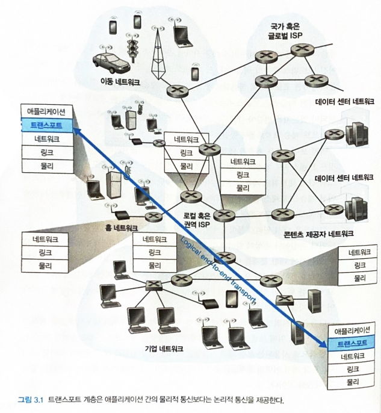

# 3.1 트랜스포트 계층 서비스 및 개요

트랜스포트 계층 프로토콜은 다른 호스트에서 동작하는 애플리케이션 프로세스간의 **논리적 통신**을 제공함.

**논리적 통신** (애플리케이션의 관점) : 프로세스들이 동작하는 호스트들이 직접 연결된 것처럼 보인다는 것.

애플리케이션 프로세스는 메시지 운반에 사용되는 물리적 인프라스트럭처의 세부 사항에 상관없이 서로 메시지를 송신하기 위해 트랜스포트 계층에서 제공하는 논리적 통신을 사용함.

트랜스포트 계층 프로토콜은 네트워크 라우터가 아닌 종단 시스템에서 구현됨. 송신 측의 트랜스포트 계층은 송신 애플리케이션 프로세스로부터 수신한 메시지를 `트랜스포트 계층 세그먼트`라고 알려진 트랜스포트 계층 패킷으로 변환함.

애플리케이션 메시지를 트랜스포트 계층 세그먼트로 만들기 위해 작은 조각으로 분할 → 각 조각에 트랜스포트 계층 헤더를 추가함으로써 수행됨. → 트랜스포트 계층은 송신 종단 시스템에 있는 네트워크 계층으로 세그먼트 전달 → 여기서 세그먼트가 네트워크 계층 패킷(데이터그램)안에 캡슐화되어 목적지로 전달됨.

네트워크 라우터는 `오로지 데이터그램의 네트워크 계층 필드에 대해 동작한다`는 것을 유의해야함.

(라우터는 데이터그램 아넹 캡슐화된 트랜스포트 계층 세그먼트의 필드를 검사하지 않음.)

수신 측에서 네트워크 계층은 데이터그램으로부터 트랜스포트 계층 세그먼트를 추출하고 트랜스포트 계층으로 세그먼트를 보냄.

이후, 트랜스포트 계층은 수신 애플리케이션에서 세그먼트 내부의 데이터를 이용할 수 있도록 수신된 세그먼트를 처리함.

인터넷 → TCP, UDP라는 두 가지 프로토콜 갖고 있음.

## 3.1.1 트랜스포트 계층과 네트워크 계층 사이의 관계

트랜스포트 계층은 프로토콜 스택에서 네트워크 계층 바로 상위에 존재한다는 것을 기억하자.

트랜스포트 계층 프로토콜

- 각기 다른 호스트에서 동작하는 프로세스들 사이의 논리적 통신을 제공함.

네트워크 계층 프로토콜

- 호스트들 사이의 논리적 통신을 제공함.

⇒ 두 개의 프로토콜 차이를 아는 것은 중요하다 !!

(책. 168쪽에 앤과 빌의 예시 참고)

트랜스포트 프로토콜들은 종단 시스템에 존재함. 종단 시스템 안에서 트랜스포트 프로토콜은 애플리케이션 프로세스에서 네트워크 경계(즉, 네트워크 계층)까지 메시지를 운반하며, 또한 반대 방향으로 네트워크 계층에서 애플리케이션 프로세스로 메시지를 운반함.

BUT, 트랜스포트 프로토콜은 메시지가 네트워크 계층 내부에서 어떻게 이동하는지는 언급하지 않음.

실제로 중간 라우터는 트랜스포트 계층이 애플리케이션 메시지에 추가한 어떤 정보도 인식하지 못하며 그 정보에 영향을 주지도 않음.

트랜스포트 계층이 제공할 수 있는 서비스는 하위 네트워크 계층 프로토콜의 서비스 모델에 의해 제약받음. 만약, 네트워크 계층 프로토콜이 호스트 사이에서 전송되는 트랜스포트 계층 세그먼트에 대한 지연 보장이나 대역폭 보장을 제공할 수 없다면, 트랜스포트 계층 프로토콜은 프로세스끼리 전송하는 메시지에 대한 지연 보장이나 대역폭 보장을 제공할 수 없음.

그럼에도 불구하고 하위 네트워크 프로토콜이 상응하는 서비스를 제공하지 못할 때도, 특정 서비스는 트랜스포트 프로토콜에 의해 제공될 수 있음.

ex. 네트워크 프로토콜이 패킷을 분실하거나 손상시키거나 복사본을 만들 때도, 애플리케이션에게 신뢰적인 데이터 전송 서비스를 제공할 수 있음.

## 3.1.2 인터넷 트랜스포트 계층의 개요

- **UDP**: 비신뢰적이고 비연결형인 서비스를 요청한 애플리케이션에 제공하는 트랜스포트 계층 프로토콜
- **TCP**: 신뢰적이고 연결지향형 서비스를 요청한 애플리케이션에게 제공하는 트랜스포트 계층 프로토콜

네트워크 애플리케이션을 설계할 때 개발자는 두 가지 트랜스포트 프로토콜 중 하나를 명시해야 함. 애플리케이션 개발자는 소켓 생성할 때 TCP와 UDP 중 하나를 선택해야함.

인터넷에서 트랜스포트 계층 패킷을 `세그먼트`로 일컫음. 일단 책에서는 TCP와 UDP 패킷을 모두 **세그먼트**로 지칭하고, 네트워크 계층 패킷에 대해 **데이터그램**이라는 용어를 사용함.

인터넷의 네트워크 계층 프로토콜은 `인터넷 프로토콜(IP)`라는 이름을 갖음.

IP 서비스 모델은 호스트들 간에 논리적 통신을 제공하는 **최선형 전달 서비스**임. ⇒ IP가 통신하는 호스트들 간에 세그먼트를 전달하기 위해 최대한 노력하지만, `어떠한 보장도 하지 않는다`는 것을 의미함.

**IP는 세그먼트의 전달을 보장하지 않고 세그먼트가 순서대로 전달되는 것을 보장하지 않음.**

**IP는 세그먼트 내부 데이터의 무결성을 보장하지 않음**

(데이터 무결성이란? → 데이터의 정확성, 일관성, 유효성이 유지되는 것을 의미함.)

- 정확성: 중복이나 누락이 없는 상태
- 일관성: 원인과 결과의 의미가 연속적으로 보장되어 변하지 않는 상

⇒ 이러한 이유로 IP를 비신뢰적인 서비스라고 부름.

그리고 **각 호스트가 적어도 하나의 IP 주소를 갖고 있다**는 것을 기억하자.

UDP와 TCP의 가장 기본적인 기능: 종단 시스템 사이의 IP 전달 서비스를 종단 시스템에서 동작하는 두 프로세스 간의 전달 서비스로 확장하는 것임. `호스트 대 호스트 전달`을 `프로세스 대 프로세스 전달`로 확장하는 것을 **트랜스포트 계층 다중화와 역다중화**라고 부름.

UDP와 TCP는 헤더에 오류 검출 필드를 포함함으로써 무결성 검사를 제공함.

최소한의 두 가지 트랜스포트 계층 서비스(**프로세스 대 프로세스 데이터 전달과 오류 검출**)가 UDP가 제공하는 유일한 두 가지 서비스.

UDP는 IP와 마찬가지로 `비신뢰적인 서비스`. UDP는 하나의 프로세스에 의해 전송된 데이터가 손상되지 않고 목적지 프로세스에 도착한다는 것을 보장하지 않음.

TCP는 애플리케이션에 몇 가지 추가적인 서비스를 제공함.

TCP는 **신뢰적인 데이터 전송**을 제공함. 흐름제어, 순서 번호, 확인 응답, 타이머를 사용함으로써 TCP는 송신하는 프로세스로부터 수신하는 프로세스에게 데이터가 순서대로 정확하게 전달되도록 확실하게 함.

⇒ TCP는 송신하는 프로세스로부터 수신하는 프로세스에게 데이터가 순서대로 정확하게 전달되록 확실하게 함.

TCP는 `혼잡 제어`를 사용함. 혼잡 제어는 전체를 위한 일반 서비스임.

- 한 TCP연결이 과도한 양의 트래픽으로 모든 통신하는 호스트들 사이의 스위치와 링크를 혼잡하게 하는 것을 방지하는 것이 TCP 혼잡 제어임. TCP는 혼잡한 네트워크 링크에서 각 TCP 연결이 링크의 대역폭을 공평하게 공유하여 통과하도록 해줌.
- 송신 측의 TCP가 네트워크에 보낼 수 있는 트래픽을 조절함으로써 수행됨.
- 반면에 UDP 트래픽은 조절되지 않음. UDP 트랜스포트 프로토콜을 사용하는 애플리케이션은 허용이 되는 한 그것이 만족하는 어떤 속도로든 전송할 수 있음.
