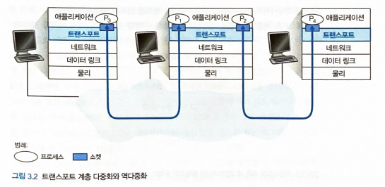
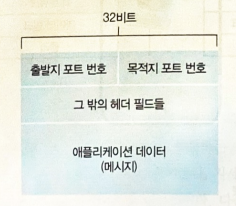
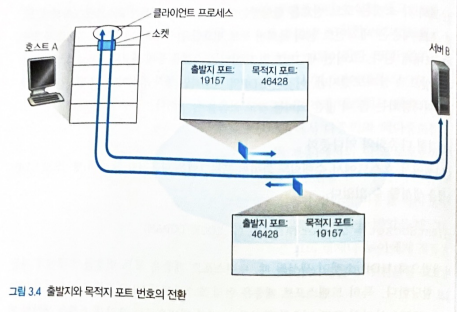
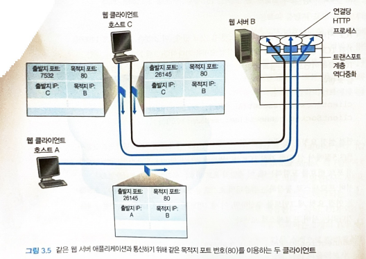

# 3.2 다중화와 역다중화

**트랜스포트 계층 다중화와 역다중화 ⇒ 네트워크 계층이 제공하는 호스트 대 호스트 전달 서비스에서 `호스트에서 동작하는 애플리케이션에 대한 프로세스 대 프로세스 전달 서비스`로 확장하는 것을 살펴봄.**

다중화와 역다중화는 모든 컴퓨터 네트워크에서 필요함.

목적지 호스트에서의 트랜스포트 계층은 네트워크 계층으로부터 `세그먼트를 수신`함.

트랜스포트 계층은 호스트에서 도작하는 해당 애플리케이션 프로세스에게 이 세그먼트의 데이터를 전달하는 의무를 짐.

(ex. 하나의 FTP 세션, 2개의 텔넷 세션을 실행하면서 웹 페이지를 다운로드하고 있다고 가정하면, 우리는 동작 중인 4개의 네트워크 애플리케이션 프로세스를 갖음. → 텔넷 프로세스 2개, FTP 프로세스 1개, HTTP 프로세스 1개)

우리의 컴퓨터의 트랜스포트 계층이 하위의 네트워크 계층으로부터 데이터를 수신할 때, 트랜스포트 계층은 이 4개의 프로세스 중 하나에게 수신한 데이터를 전달할 필요가 있음.



네트워크 애플리케이션의 한 부분으로서 프로세스가 **소켓**을 갖고 있음. 이를 통해 네트워크에서 프로세스로 데이터를 전달하고, 프로세스로부터 네트워크로 데이터를 전달하는 출입구 역할을 함.

그러므로 위의 그림과같이 수신 측 호스트의 트랜스포트 계층은 실제로 데이터를 직접 프로세스로 전달하지 않고 중간 매개자인 소켓에게 전달함.

주어진 시간에 수신 측 호스트에 하나 이상의 소켓이 있을 수 있으므로, 각각의 소켓은 하나의 유일한 식별자를 갖게 되는데, 이 식별자의 포맷은 소켓이 UDP인지 TCP인지에 따라 달라짐.

수신 측 호스트가 수신한 트랜스포트 계층 세그먼트를 어떻게 `적절한 소켓으로 향하게 하는지`를 알아보자.

각 트랜스포트 계층 세그먼트는 이러한 목적을 위해 세그먼트에 필드 집합을 갖고 있음. 수신 측의 트랜스포트 계층은 수신 소켓을 식별하기 위해 필드를 검사하게됨. 그리고 이 세그먼트를 해당 소켓으로 보냄.

`트랜스포트 계층 세그먼트의 데이터를 올바른 소켓으로 전달하는 작업`을 **역다중화**라고 함.

출발지 호스트에서 소켓으로부터 데이터를 모으고, 이에 대한 세그먼트를 생성하기 위해 각 데이터에 헤더 정보로 캡슐화하고, 그 `세그먼트들을 네트워크 계층으로 전달하는 작업`을 **다중화**라고 함.

위의 그림에서 중간 호스트의 트랜스포트 계층은 네트워크 계층 아래로부터 수신한 세그먼트를 위쪽의 프로세스 P1 or P2로 반드시 역다중화해야 함. 이것은 도착한 세그먼트의 데이터가 이에 상응하는 프로세스의 소켓으로 전달되도록 해서 이루어짐.

역다중화 작업의 이해를 돕기위해 3.1절에서 예제로 설명하였던 집안의 비유를 다시 살펴봄.

> 각각의 아이는 이름으로 구별됨. 빌이 집배원으로부터 우편 한 묶음을 받았을 때, 그는 그 우편물이 누구에게 온 것인지를 살펴보고, 그 우편물을 그의 형제나 누이에게 직접 전달함으로써 **역다중화** 작업을 수행함. 앤은 그녀의 오빠와 자매들의 우편물을 모으고 집배원에게 넘겨줄 때 **다중화** 작업을 수행함.



트랜스포트 계층 다중화의 두 가지 요구사항

- 소켓은 유일한 식별자를 갖음.
- 각 세그먼트는 세그먼트가 전달될 적절한 소켓을 가리키는 특별한 필드를 갖음.
  - 특별한 필드 → `출발지 포트 번호 필드, 목적지 포트 번호 필드`

0~1023까지의 포트 번호를 잘 알려진 포트 번호라고 하여 사용을 엄격하게 제한하고 있음. 즉, HTTP_80번, FTP_21번 처럼 잘 알려진 애플리케이션 프로토콜에서 사용되도록 예약되어 있음.

`UDP의 기본적인 동작 방식`

- 호스트의 각 소켓은 포트 번호를 할당 받음.
- 세그먼트가 호스트에 도착하면, 트랜스포트 계층은 세그먼트 안의 목적지 포트 번호를 검사하고 상응하는 소켓으로 세그먼트를 보내게 됨.
- 세그먼트의 데이터는 소켓을 통해 해당되는 프로세스로 전달됨.

---

## 비연결결형 다중화와 역다중화

```python
clientSocket = socket(AF_INET, SOCK_DGRAM) // UDP 소켓 생성
```

위의 방법으로 UDP 소켓 생성될 때, 트랜스포트 계층은 `포트 번호를 소켓에게 자동으로 할당`함.

특히 트랜스포트 계층은 현재 호스트에서 UDP 포트로 사용하지 않는 1024~65535 사이의 포트 번호를 할당함.

다른 방법으로는, 우리가 소켓을 생성한 뒤에, 소켓 `bind()`방식을 사용하여 특정 포트번호를 UDP 소켓에 할당하기 위해 소스코드 한 줄을 추가할 수 있음.

```python
clientSocket.bind(('', 19157)) // 19157번 UDP 소켓에 할당
```

애플리케이션의 서버 측이 특정 포트 번호를 할당하는 것에 반하여, 애플리케이션의 클라이언트 측은 트랜스포트 계층이 포트 번호를 자동으로 할당함.

UDP 소켓 19157을 가진 호스트 A의 프로세스가 호스트 B의 UDP 소켓 46428을 가진 프로세스에게 애플리케이션 데이터 전송을 원한다고 가정함.

- 호스트 A의 트랜스포트 계층은 애플리케이션 데이터, 출발지 포트번호(19157), 목적지 포트 번호(46428), 그리고 2개의 다른 값을 포함하는 `트랜스포트 계층 세그먼트`를 생성함.
- 트랜스포트 계층은 만들어진 세그먼트를 네트워크 계층으로 전달함.
- 네트워크 계층은 세그먼트를 IP 데이터그램으로 `캡슐화`하고 최선형 전달 서비스로 세그먼트를 수신 호스트로 전달함.
- 세그먼트가 수신 호스트B에 도착하면, 수신 호스트는 세그먼트 안의 목적지 포트 번호(46428)를 검사하고 그 세그먼트를 포트 46428로 식별되는 소켓에 전달함.
  - 호스트 B에 여러 프로세스가 수행될 수 있음!
- 프로세스들은 각각 UDP 소켓과 그와 연관된 포트 번호를 갖게되며, 네트워크로부터 UDP 세그먼트들이 도착하면, 호스트 B는 세그먼트의 목적지 포트를 검사하여 세그먼트를 적절한 소켓으로 보냄.(역다중화)

UDP 소켓이 `목적지 IP주소와 목적지 포트 번호로 구성된 두 요소`로 된 집합에 의해 식별됨!

만약 2개의 UDP 세그먼트가 출발지 IP 주소와 출발지 포트 번호가 모두 다르거나 출발지 IP 주소와 출발지 포트 번호 중 어느 하나가 다를지라도, `같은 목적지 IP 주소와 목적지 포트 번호`를 가지면 2개의 세그먼트는 같은 목적지 소켓을 통해 같은 프로세스로 향할 것임.



출발지 포트 번호는 `회신 주소`의 한 부분으로 사용됨.

---

## 연결지향형 다중화와 역다중화

TCP 역다중화를 수행하려면 TCP 소켓과 TCP 연결 설정을 살펴봐야 함.

TCP 소켓과 UDP 소켓이 `다른 점`은 TCP 소켓은 4개 요소의 집합, 즉 출발지 IP 주소, 출발지 포트 번호, 목적지 IP 주소, 목적지 포트 번호에 의해 식별된다는 것임. 그래서 네트워크로부터 호스트에 TCP 세그먼트가 도착하면, 호스트는 해당되는 소켓으로 세그먼트를 전달(역다중화)하기 위해 4개의 값을 모두 사용함.

특히 UDP와는 다르게 `다른 출발지 주소 또는 다른 출발지 포트 번호`를 가지고 도착하는 2개의 TCP 세그먼트는 2개의 다른 소켓으로 향하게 됨.

### TCP 클라이언트/서버 프로그램

- TCP 서버 애플리케이션은 `환영 소켓`을 갖고 있음. 이 소켓은 포트 번호 12000을 가진 TCP 클라이언트로부터 연결 설정 요청을 기다림.
- TCP 클라이언트는 아래와 같은 명령으로 소켓을 생성하고 연결 설정 요청 세그먼트를 보냄.
  ```python
  clientSocket = socket(AF_INET, SOCK_STREAM)
  clientSocket.connect((serverName, 12000))
  ```
- 연결 설정 요청은 목적지 포트 번호 12000과 TCP 헤더에 설정된 특별한 연결 설정 비트를 가진 TCP 세그먼트에 지나지 않음. 또한 그 세그먼트는 출발지 포트 번호를 포함하는데, 이 출발지 포트 번호는 클라이언트가 선택한 번호임.
- 서버 프로세스로 동작하는 컴퓨터의 호스트 운영체제가 목적지 포트 12000을 포함하는 연결 요청 세그먼트를 수신하면, 이 세그먼트를 포트 번호 12000으로 연결 수락을 기다리는 서버 프로세스로 보냄.
  ```python
  connectionSocket, addr = serverSocket.accept()
  ```
- 서버는 연결 요청 세그먼트의 아래와 같은 4가지 값을 주목함.
  - 세그먼트 안의 출발지 포트 번호
  - 출발지 호스트의 IP 주소
  - 세그먼트 안의 목적지 포트 번호
  - 목적지 IP 주소

서버 호스트는 동시에 존재하는 많은 TCP 소켓을 지원할 수 있음. 각각의 소켓은 프로세스에 접속되어 있으며, 이들 소켓은 4개의 요소의 집합에 의해 식별됨. TCP 세그먼트가 호스트에 도착하면, 4가지 필드 모두는 해당되는 소켓으로 세그먼트를 전달하기(역다중화) 위해 사용됨.



호스트 C가 서버 B로 2개의 HTTP 세션을 시작하고, 호스트 A가 호스트 B로 하나의 HTTP 세션을 시작하는 상황임. 호스트 A와 호스트 C, 그리고 서버 B는 각자 유일한 IP 주소인 A, C, B를 각각 갖고 있음. 호스트 C는 2개의 출발지 포트 번호(26145, 7532)를 자신의 HTTP 연결에 할당함. 호스트 A는 C와 독립적으로 출발지 포트 번호를 선택하므로, 이것 또한 HTTP 연결에 출발지 포트로 26145를 할당할 수도 있음. 2개의 연결은 다른 출발지 IP 주소를 가지므로 서버 B는 같은 출발지 포트 번호를 가진 연결을 올바르게 역다중화할 수 있음.

---

## 웹 서버와 TCP

클라이언트와 서버가 지속적인 HTTP를 사용한다면, 지속적인 연결의 존속 기간에 클라이언트와 서버는 같은 서버 소켓을 통해 HTTP 메시지를 교환할 것임. BUT, 만약 클라이언트와 서버가 비지속적인 HTTP를 사용한다면, 모든 요청&응답마다 새로운 TCP 연결이 생성되고 종료될 것임. (빈번하게 발생하는 소켓 생성과 종료는 우베 서버 성능에 부담을 줌.)
