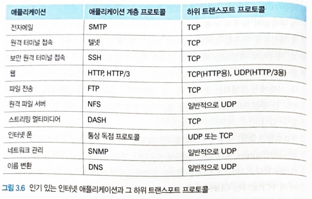
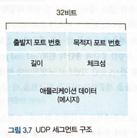
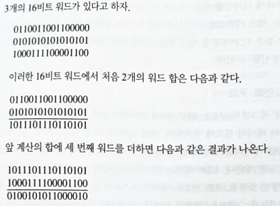

# 3.3 비연결형 트랜스포트: UDP

UDP가 어떻게 동작하고 무엇을 하는지에 대해 살펴본다.

트랜스포트 프로토콜 설계에 관심이 있다는 가정

- 아무 일도 하지 않는 트랜스포트 프로토콜을 사용하는 것을 고려가능
- 송신 측에서 애플리케이션 프로세스로부터 메시지를 얻어서 네트워크 계층에 직접 넘겨주는 것
- 수신 측에서 네트워크 계층으로부터 도착한 메시지를 애플리케이션 프로세스로 직접 넘겨주는 것도 생각할 수 잇음.

`but, 최소한의 동작은 수행해야 함 .`

적어도 트랜스포트 계층은 네트워크 계층과 해당하는 애플리케이션 레벨 프로세스 간의 데이터를 넘겨주기 위해 **다중화와 역다중화 서비스를 제공**해야 함.

[RFC 768]에서 정의된 UDP는 트랜스포트 계층 프로토콜이 할 수 있는 최소 기능으로 동작함. UDP는 다중화/역다중화 기능과 간단한 오류 검사 기능을 제외하면 IP에 아무것도 추가하지 않음.

애플리케이션 개발자가 TCP 대신 UDP를 선택한다면 애플리케이션은 `거의 IP와 직접 통신하는 셈`임.

- UDP는 애플리케이션 프로세스로부터 메시지를 가져와서 다중화/역다중화 서비스에 대한 출발지 포트 번호 필드와 목적지 포트 번호 필드를 첨부하고 다른 두 필드를 추가한 후에 최종 세그먼트를 네트워크 계층으로 넘겨줌.
- 네트워크 계층은 트랜스포트 계층 세그먼트를 IP 데이터그램으로 캡슐화하고, 세그먼트를 수신 호스트에게 전달하기 위해 최선을 다함.
  - IF, 세그먼트가 수신 호스트에 도착한다면, UDP는 세그먼트의 데이터를 해당하는 애플리케이션 프로세스로 전달하기 위해 목적지 포트 번호를 사용함.
- UDP는 세그먼트를 송신하기 전에 송신 트랜스포트 계층 개체들과 수신 트랜스포트 계층 개체들 사이에 핸드셰이크를 사용하지 않는다는 점을 주의해야함. ⇒ `UDP를 비연결형이라고 함`

`애플리케이션 개발자가 TCP보다 UDP 방식으로의 개발을 선호하는 이유`(많은 애플리케이션이 UDP에 적합한 이유)

- 무슨 데이터를 언제 보낼지에 대해 애플리케이션 레벨에서 더 정교한 제어
  - UDP 하에서 애플리케이션 프로세스가 데이터를 UDP에게 전달하자마자 UDP는 데이터를 UDP 세그먼트로 만들고, 그 세그먼트를 즉시 네트워크 계층으로 전달함.
  - TCP는 혼잡 제어 메커니즘을 갖고 있는데, 이 메커니즘은 목적지 호스트들과 출발지 호스트들 사이에서 하나 이상의 링크가 과도하게 혼잡해지면, 트랜스포트 계층 TCP 송신자를 제한함.
  - TCP는 신뢰적인 전달이 얼마나 오래 걸리는지에 관계없이 목적지가 세그먼트의 수신 여부를 확인응답할 때까지 데이터의 세그먼트 재전송을 계속할 것임.
  - 실시간 애플리케이션은 최소 전송률을 요구할 때도 있고, 지나치게 지연되는 세그먼트 전송을 원하지 않으며, 조금의 데이터 손실은 허용할 수도 있으므로, TCP의 서비스 모델은 이러한 애플리케이션의 요구와는 맞지 않음.
- 연결 설정이 없음.
  - TCP는 데이터 전송을 시작하기 전 `세 방향 핸드셰이크`를 사용함. UDP는 공식적인 사전준비 없이 바로 전송함. ⇒ UDP는 연결을 설정하기 위한 어떠한 지연도 없음.
  - HTTP 문서로 된 웹 페이지는 신뢰성이 중요하기 때문에 UDP 보다는 TCP를 사용함.
    - HTTP에서 TCP 연결 설정 지연은 웹 문서 다운로드 지연의 심각한 원인임. 구글 크롬에서 사용되는 `QUIC 프로토콜`은 기본 트랜스포트 프로토콜로 UDP를 사용하고 UDP 위에 애플리케이션 계층 프로토콜의 안정성을 구현함.
- 연결 상태가 없음.
  - TCP는 종단 시스템에서 연결 상태를 유지함. 연결 상태는 수신 버퍼와 송신 버퍼, 혼잡 제어 파라미터, 순서 번호와 확인응답 번호 파라미터를 포함함.
  - 상태 정보가 TCP의 신뢰적인 데이터 전송 서비스를 구현하고 혼잡 제어를 제공하는 데 필요함.
  - UDP는 연결 상태를 유지하지 않으며 파라미터 중 어떠한 것도 기록하지 않음.
  - 일반적으로 특정 애플리케이션 전용 서버는 애플리케이션 프로그램이 TCP보다 UDP에서 동작할 때 일반적으로 좀 더 많은 액티브 클라이언트를 수용할 수 있음.
- 작은 패킷 헤더 오버헤드
  - TCP는 세그먼트마다 20바이트의 헤더 오버헤드를 갖지만, UDP는 단지 8바이트의 오버헤드를 갖음.

최신 버전의 HTTP는 UDP를 통해 실행되어 애플리케이션 계층에서 자체 오류 제어 및 혼잡 제어를 제공함. 그럼에도 불구하고 많은 중요 애플리케이션들은 TCP보다 UDP에서 동작함.

(ex. UDP는 네트워크 관리 데이터를 전달하는데 사용됨. 네트워크 관리 애플리케이션은 네트워크가 혼잡한 상태에 있을 때 동작해야 하므로 이러한 경우에는 UDP가 TCP보다 더 바람직함.)

모든 애플리케이션에서는 적은 양의 패킷 손실은 허용할 수 있음. 따라서 신뢰적인 데이터 전송이 애플리케이션의 성능에 절대적으로 중요한 것만은 아님.

인터넷 전화와 화상 회의 같은 실시간 애플리케이션들은 TCP 혼잡 제어가 나쁜 영향을 미침. 멀티미디어 애플리케이션 개발자들은 그들의 애플리케이션이 TCP 대신에 UDP에서 동작하도록 구현함.

UDP는 혼잡 제어를 하지 않음. 그러나 혼잡 제어는 네트워크가 꼭 필요한 작업을 할 수 없게 되는 폭주 상태에 빠지는 것을 막기 위해 반드시 필요함.

만약 모두가 혼잡 제어를 사용하지 않고 높은 비트의 비디오 스트리밍을 시작한다면, 라우터에 많은 패킷 오버플로가 발생할 것이고, 이는 소수의 UDP 패킷만이 출발지-목적지 간의 경로를 무사히 통과하게 할 것임. 또한 무엇보다도 제어되지 않은 UDP 송신자에 의해 발생한 높은 손실률은 그 손실률을 감소시키기 위해 TCP 송신자들이 속도를 줄이도록 할 것임.⇒ UDP의 혼잡 제어 결여는 UDP 송신자와 수신자 간의 높은 손실률을 초래할 수도 있고, TCP 세션의 혼잡이 발생할 수 있으며 이는 잠재적으로 심각한 문제점임.

애플리케이션이 UDP를 사용할 때도 신뢰적인 데이터 전송이 가능함.

만약 애플리케이션이 신뢰성을 애플리케이션 자체에서 제공한다면 신뢰적인 데이터 전송이 가능함. 앞에서 QUIC 프로토콜은 UDP 상에서 애플리케이션 계층에 신뢰성을 구현했음. → 이는 개발자 입장에서 어려운 작업.

---

## 3.3.1 UDP 세그먼트 구조

애플리케이션 데이터는 UDP 데이터그램의 데이터 필드에 위치함.

- DNS에 대한 데이터 필드에는 질의 메시지나 응답 메시지를 포함함.
- 스트리밍 오디오 애플리케이션에서는 오디오 샘플이 데이터 필드를 채움.

체크섬은 세그먼트에 오류가 발생했는지를 검사하기 위해 수신 호스트가 사용함.

길이 필드는 헤더를 포함하는 UDP 세그먼트의 길이를 나타냄. (바이트 단위)

---

## 3.3.2 UDP 체크섬

UDP 체크섬은 `오류검출`을 위한 것임. 즉, 체크섬은 세그먼트가 출발지로부터 목적지로 이동했을 때, UDP 세그먼트안의 미트에 대한 변경사항이 있는지 검사하는 것임.

송신자 측에서 UDP는 세그먼트 안에 있는 모든 16비트 워드의 합산에 대해 다시 1의 보수를 수행하며, 합산 과정에서 발생하는 오버플로는 윤회식 자리올림을 함. 이 결괏값이 UDP 세그먼트의 체크섬 필드에 삽입됨.

⇒ 패킷에 어떠한 오류도 없다면, 수신자에서의 합은 1111..11111이 될 것임. 만약 비트 중 하나라도 0이 있다면, 패킷에 오류가 발생했음을 알 수 있음.

UDP가 왜 체크섬을 제공하는가? ⇒ `출발지와 목적지 사이의 모든 링크가 오류 검사를 제공한다는 보장이 없기 때문` 즉, 링크 중에서 하나가 오류 검사를 제공하지 않는 프로토콜을 사용할 수도 있다는 것임.

세그먼트들이 정확하게 링크를 통해 전송되었을지라도, 세그먼트가 라우터의 메모리에 저장될 때 비트 오류가 발생할 수가 있음. 주어진 링크 간의 신뢰성과 메모리의 오류 검사가 보장되지도 않고, 종단 간의 데이터 전송 서비스가 오류 검사를 제공해야 한다면, UDP는 종단 기반으로 트랜스포트 계층에서 오류 검사를 제공해야만 함. ⇒ **종단과 종단의 원칙의 예시**

어떠한 기능이 종단 기반으로 구현되어야 하므로, `하위 레벨에 있는 기능들은 상위 레벨에서 이들을 제공하는 비용과 비교했을 때 중복되거나 거의 가치가 없을 수 있다`는 것.

IP는 어떠한 2계층 프로토콜에서도 동작해야 하므로, 트랜스포트 계층은 안전장치로서 오류 검사를 제공하는 것이 유용함. UDP는 오류 검사를 제공하지만, 오류를 회복하기 위한 어떠한 일도 하지 않음.

일부 UDP 구현에서는 손상된 세그먼트를 그냥 버리기도 하고, 다른 구현에서는 경고와 함께 손상된 세그먼트를 애플리케이션에게 넘겨주기도 함.
